# Batch Processing Data Architecture 🚀📊

<!-- Top Tech Stack Badges -->
<div align="center">
  <a href="https://azure.microsoft.com/">
    
  </a>
  <a href="https://azure.microsoft.com/">
    
  </a>
  <a href="https://azure.microsoft.com/">
    
  </a>
  <a href="https://portal.azure.com/">
    
  </a>
  <a href="https://www.postgresql.org/">
    
  </a>
  <a href="https://databricks.com/">
    
  </a>
  <a href="https://azure.microsoft.com/en-us/services/storage/blobs/">
    
  </a>
  <a href="https://azure.microsoft.com/en-us/services/key-vault/">
    
  </a>
  <a href="https://azure.microsoft.com/">
    
  </a>
  <a href="https://azure.microsoft.com/">
    
  </a>
  <a href="https://azure.microsoft.com/">
    
  </a>
  <a href="https://www.python.org/">
    
  </a>
</div>

---

## 📖 Introduction

**Batch Processing Data Architecture** is a robust project that builds a scalable, dependable, and maintainable data processing backend on the Azure platform. Designed as the backbone for a machine learning application, it efficiently processes enormous amounts of data, performs necessary preprocessing, and aggregates it for downstream ML tasks.

The system leverages canonical software components and data engineering best practices to integrate multiple Azure services for a comprehensive solution.


---

## ✨ Key Features

- **Scalable Batch Processing:** Efficiently processes massive datasets in scheduled batches.
- **ETL Workflows:** Custom Python scripts for data extraction, transformation, and loading.
- **Azure Integration:** Leverages Blob Storage, PostgreSQL, Databricks, Key Vault, and more.
- **Modular Design:** Easy-to-maintain code structure with dedicated ETL and loading scripts.

---

## 🔄 Flow Diagram

```mermaid
flowchart TD
    A[📄 CSV Data Source] --> B[🔄 ETL_batchdata.py]
    B --> C[🧹 Data Transformation & Aggregation]
    C --> D[📤 loadtoblobtable.py]
    D --> E[💾 Storage :Azure Blob/PostgreSQL]
    E --> F[📈 Machine Learning Application]
```



---

## 🗂️ Project Structure

```plaintext
batch-processing/
├── .gitignore                          # Git ignore file
├── ETL_batchdata.py                    # Main ETL script for batch data processing
├── loadtoblobtable.py                  # Script to load processed data into storage
├── GoudaShanbog_DadaNanjesha_10220129_Data Engineering_Phase1.pdf  # Phase 1 design document
├── GoudaShanbog_DadaNanjesha_10220129_Data Engineering_Phase2.pdf  # Phase 2 design document
├── GoudaShanbog_DadaNanjesha_10220129_Data Engineering_Phase3.pdf  # Phase 3 design document
├── Project structure.png               # Visual diagram of project architecture
└── output file.pdf                     # Sample output report from data aggregation
```

---

## 💻 Setup Steps

Before getting started, ensure you have an active [Azure subscription](https://azure.microsoft.com/).

1. **Create Your Azure Environment:**
   - Set up your Azure subscription and create a Resource Group.
   - Provision necessary services such as Azure Blob Storage, PostgreSQL, Databricks, Key Vault, etc.

2. **Prepare Your Data:**
   - Deploy your CSV data into the PostgreSQL database or Blob Storage as needed.

3. **Run the ETL Process:**
   - Execute the `ETL_batchdata.py` script to extract, transform, and prepare your data.
   - Run `loadtoblobtable.py` to load the processed data into your target storage.

4. **Integrate with ML Application:**
   - Ensure your machine learning application can access the processed data from the designated storage.

---

## 📜 License

This project is licensed under the [MIT License](LICENSE).

---

## 🙏 Acknowledgements

- **Azure Services:** For providing a robust, scalable infrastructure.
- **Data Engineering Principles:** Guiding our modular and reliable architecture.
- **Contributors:** Thank you to everyone who supported and contributed to this project.

---

*Happy Data Processing! 🚀📊*
